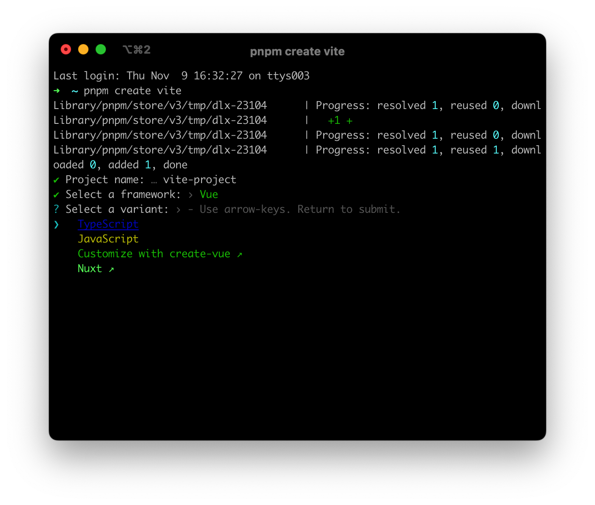
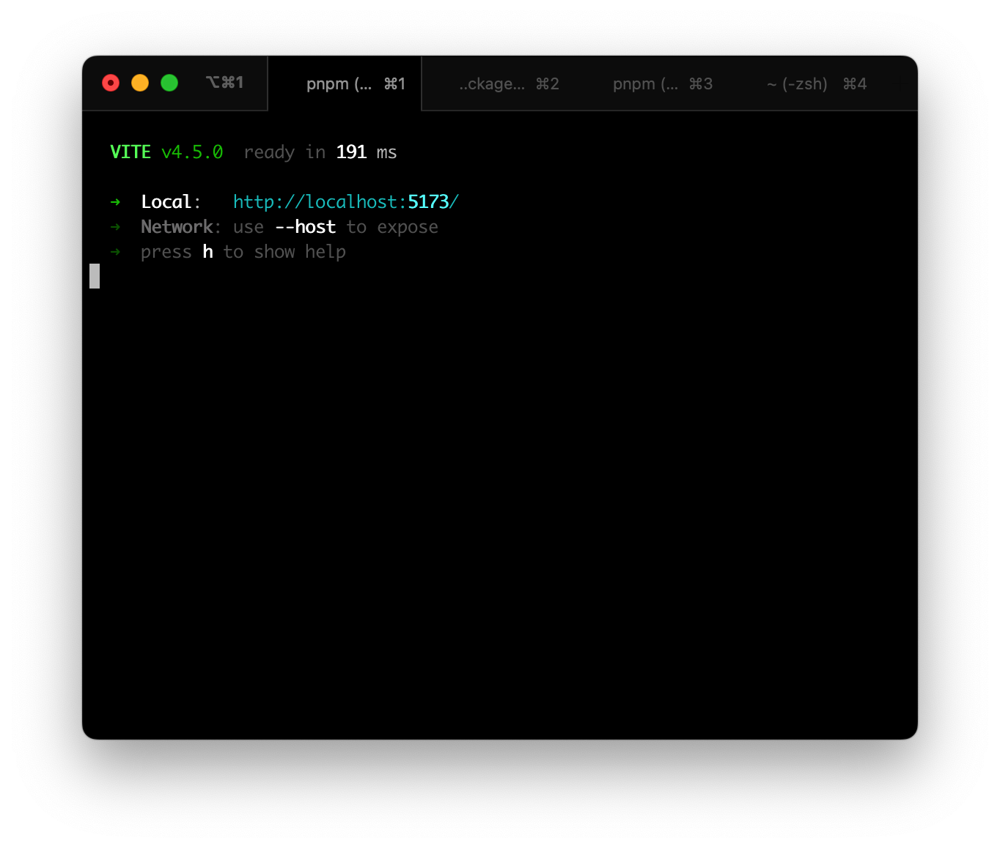

# Das Front-End Web 快速上手


## 步骤总览

1. 使用vite创建开发仓库

2. 代码入口引入@das-fe/web来创建应用

3. vite配置文件引入@das-fe/cli的插件配置

4. 使用@das-fe/cli增加自定义调试和打包脚本

5. 调试

6. 添加业务模块（页面）

7. 打包

8. 嵌入达实AIoT平台

   

示例项目仓库地址：https://github.com/das-fe/web-example.git

示例项目在线预览：https://das-fe-web-example.vercel.app

## 一、使用vite创建开发仓库

搭建项目总体项目的技术栈为：pnpm+vite+vue3.3+typescript5，创建项目时需要注意选项。

打开 https://vitejs.dev/guide 查看指引，这里使用pnpm来创建项目；打开命令行键入：

```
$ pnpm create vite
```

选择最后如下：



## 二、代码入口引入@das-fe/web来创建应用

项目创建完成之后，创建的为SPA单页应用，代码入口路径是src/main.ts。在代码入口文件修改创建应用的方式，引入@das-fe/web来创建引用。可以安装依赖后，再修改代码入口。

1. 安装依赖，命令行依次键入以下两行代码：

```
pnpm i
```

```
pnpm add @das-fe/web @das-fe/ui vue-router
```

2. 修改入口代码，创建das-fe的应用，修改后的代码如下

```js
import { createApp } from 'vue'
import './style.css'
import App from './App.vue'
import { dasWeb } from '@das-fe/web'
import '@das-fe/ui/dist/style.css'

const app = createApp(App)
app.use(dasWeb, {
  plugins: import.meta.glob('@/plugins/*/index.ts', { eager: true }),
  router: import.meta.glob('@/views/*/router.ts', { eager: true }),
  theme: import.meta.glob('@/views/*/theme/*.ts', { eager: true }),
  i18n: import.meta.glob('@/views/*/i18n/*.ts', { eager: true }),
})
app.mount('#app')

```

3. 修改App.vue增加router-view标签为后续增加路由页面做准备，App.vue template中增加的标签如下：

   ```
   ...
   <router-view></router-view>
   ...
   ```

4. 为了整体es module能正常使用，package.json中设置type属性为module。

## 三、vite配置文件引入@das-fe/cli的插件配置

项目创建完成之后，项目根目录下会有一个vite.config.ts文件，我们需要修改这个文件，可以把项目变成das-fe的微前端子应用或者独立部署。修改之前需要安装@das-fe/cli来支持修改。

1. 安装依赖，命令行键入以下代码：

```
pnpm add @das-fe/cli
```

2. 修改vite.config.ts文件，修改后的代码如下：

```js
import { defineConfig } from 'vite'
import vue from '@vitejs/plugin-vue'
import { dasFeMobileVitePlugin } from '@das-fe/cli'
import { dirname, resolve } from 'path'
import { fileURLToPath } from 'url'

const __filename = fileURLToPath(import.meta.url)
const __dirname = dirname(__filename)

// https://vitejs.dev/config/
export default defineConfig({
  plugins: [vue(), dasFeMobileVitePlugin()],
  resolve: { alias: { '@': resolve(__dirname, 'src') } },
})
```

## 四、使用@das-fe/cli增加自定义调试和打包脚本

das-fe的前端应用需要一些自定义脚本收集代码内如来增加开发的体验，例如类型提示和css变量提示等；对于大型项目，碎片化的代码收集加上vite的按需加载会导致调试编译缓慢，增加自定义脚本也能加快调试速度。


1. 创建脚本之前需要安装一些依赖，命令行键入以下代码：

   ```
   pnpm add @das-fe/cli concurrently -D
   ```

   

2. 在项目中创建das-fe调试脚本，路径为scripts/dev/das-fe.js。脚本内容为：

   ```js
   import { dasFeWebDev } from '@das-fe/cli'
   dasFeWebDev()
   ```

3. 在项目中创建调试脚本，路径为scripts/dev/index.js。脚本内容为：

   ```js
   import concurrently from 'concurrently'
   import { dirname, resolve } from 'path'
   import { fileURLToPath } from 'url'
   
   const __filename = fileURLToPath(import.meta.url)
   const __dirname = dirname(__filename)
   
   const cwd = resolve(__dirname, '../../')
   
   concurrently(
     [
       { command: `node scripts/dev/das-fe.js`, name: 'das-fe' },
       { command: `npx vite`, name: 'vite' },
     ],
     { cwd },
   )
   ```

4. 在项目中创建das-fe打包脚本，路径为scripts/build/index.js。脚本内容为：

   ```js
   import { dirname, resolve } from 'path'
   import { fileURLToPath } from 'url'
   import { execSync } from 'child_process'
   import { dasFeWebBuild } from '@das-fe/cli'
   
   const __filename = fileURLToPath(import.meta.url)
   const __dirname = dirname(__filename)
   
   const cwd = resolve(__dirname, '../../')
   
   dasFeWebBuild().then(() => {
     execSync(`npx vite build`, { cwd, stdio: 'inherit' })
   })
   
   ```

5. 在package.json中完善dev和build命令。修改后的内容如下：

   ```js
   {
     ...,
     "type": "module",
     "scripts": {
       "dev": "node scripts/dev",
       "build": "node scripts/build",
       "preview": "vite preview"
     },
     ...
   }
   
   ```

## 五、调试

代码入口和vite配置以及自定义脚本都配置好可以启动调试。命令键入以下代码即可启动调试服务：

```
pnpm run dev
```

启动成功后如下图：



调试服务启动成功之后，接下来可以开始按照das-fe的模块开发规范来增加模块（业务页面）。


## 六、添加业务模块（页面）


### 模块规范

为了业务模块的开发更顺畅，并且符合整体框架“高内聚、低耦合、可插拔”的设计思路，需要遵循一定的模块开发规范。规范制定过程中框架也做了很多封装，使得业务模块的开发会更简单高效，并且可插拔，说人话就是，即使把这个模块整个删除拿掉，也不会对系统的整体运行造成影响。要实现这个“高内聚、低耦合、可插拔”的要求，模块开发规范如下：

1. 模块的存放位置：规定为src/views下的一级子文件夹，如：scr/views/demo

2. 模块的路由配置：规定为模块目录下的router.ts文件，内容遵循vue-router的路由记录配置，详情见：https://router.vuejs.org/zh/guide/。先创建一个路由挂载的文件，例如app.vue，完整的配置例子如下：

   ```js
   import type { RouteRecordRaw } from 'vue-router'
   
   export default { path: '/', component: () => import('./app.vue') } as RouteRecordRaw
   ```

3. 模块的国际化配置：规定为模块目录下的i18n/*.ts文件，内容格式为{ [key: string]  {'zh-CN': string, en: string} }。例如：

   ```js
   {
   	eidt: { 'zh-CN': '编辑', en: 'edit' }
   }
   ```

4. 模块的主题配置：规定为模块目录下的theme/*.ts文件，内容格式为{ [key: ]  {light: string, dark: string} }。例如：

   ```js
   {
   	'--body-background': { 'light': '#ffffff', dark: '#000000' }
   }
   ```


模块路由配置完成后，浏览器输入你的路由配置url，即可访问此模块。例如配置了path: '/demo'，那么浏览器输入http://localhost:5173/demo即可访问。

### 模块国际化和主题的切换

在添加完模块之后，我们可以依赖das-fe创建应用的能力快速进行国际化和主题的切换。以下是示例代码：

```js
<template>
  <button type="button" @click="setLang('zh-CN')">中</button>
  <button type="button" style="margin-left: 10px" @click="setLang('en')">英</button>
  <button type="button" @click="setTheme('light')">浅色</button>
  <button type="button" style="margin-left: 10px" @click="setTheme('dark')">深色/button>
	<router-view></router-view>
</template>

<script setup lang="ts">
import { setLang, setTheme, i18n } from '@das-fe/web'
</script>

```

完整的代码可以参照示例项目，示例项目中会有更详细的用法。


## 七、打包

业务模块都开发好后。命令键入以下代码即可启动打包服务：

```
pnpm run build
```

打包完成后的文件存放路径为根目录下的dist文件夹


## 八、嵌入达实AIoT平台


如果开发后希望嵌入达实的AIoT平台，因为是使用das-fe的插件包并且按照das-fe的模块规范进行开发，可以很方便的进行嵌入。

打包完成后得到的dist文件夹中会包含nginx.conf文件，这个文件的内容符合达实运维团队的部署规范。把整个打包后的dist文件夹提供给达实研发团队即可。


## 总结


此快速上手指南适用于达实AIoT平台web端的融合式应用开发。如果需要移动端的融合式应用开发，只需要把上述依赖的@das-fe/web、@das-fe/cli引入的脚本改写为移动端即可，模块开发规则同样适用。例如@das-fe/mobile，import { dasMobileDev, dasMobileBuild } from '@das-fe/cli'。此文档仅供快速上手，细节未提及的地方需要参考更详细的完整开发手册。（ps：此指南使用的依赖包并非完全跟生产使用的包一致，最终解释权归达实研发部）

